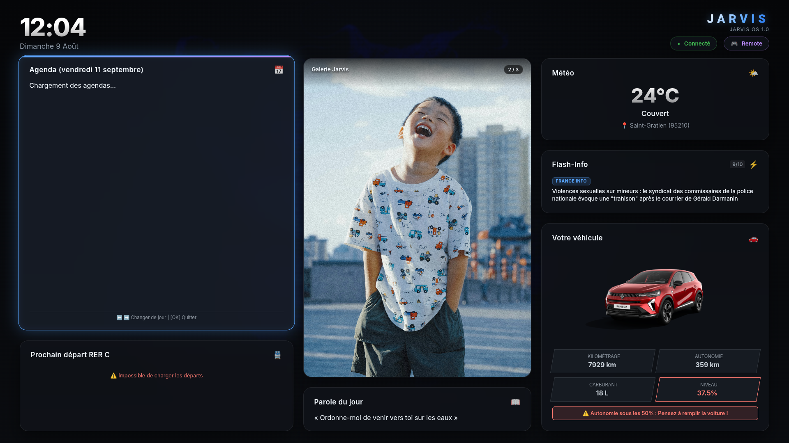

# Jarvis PDA Desk

Ce projet est un assistant personnel pour écran en lecture seule, conçu pour fonctionner avec un pavé directionnel et un bouton (résumons cela à une télécommande). Il est développé en React et utilise Vite pour le bundling. L'application est conçue pour être déployée sur un Raspberry Pi, mais peut également fonctionner sur d'autres systèmes.

> [!WARNING]
> Ce répertoire contient uniquement le code de l'application front-end. Pour le backend, veuillez consulter le dépôt [ewenrdo/jarvis-pi-backend](https://github.com/ewenrdo/jarvis-pi-backend).

## Fonctionnalités

- Affichage de l'agenda avec synchronisation des événements à partir de plusieurs sources.
- Affichage de la météo locale.
- Carrousel d'images personnalisables.
- Widget de transport pour afficher les prochains départs du RER C depuis une gare donnée.
- Affichage des données d'une voiture Renault connectée.
- Lecture du jour synchronisée avec l'[AELF](https://www.aelf.org/).

_Pour l'instant, il n'est pas possible de désactiver les widgets individuellement, mais cela pourrait être ajouté dans une future version._

> [!NOTE]
> Le code pour l'agenda est pour l'instant le même et il n'est pas modifiable : **5788**. Il est possible de le modifier dans le code source si nécessaire.

## Configuration de la dépendance

Suivez l'installation du service sur [jarvis-pi-backend](https://github.com/ewenrdo/jarvis-pi-backend).
**Il n'est pas nécessaire de cloner ce dépôt pour utiliser l'application.** Suivez simplement les instructions d'installation du backend, puis lancez l'application avec `node server.js` dans le répertoire `jarvis-pi-backend`.

## Crédits

Développé par Ewen Rodrigues de Oliveira.